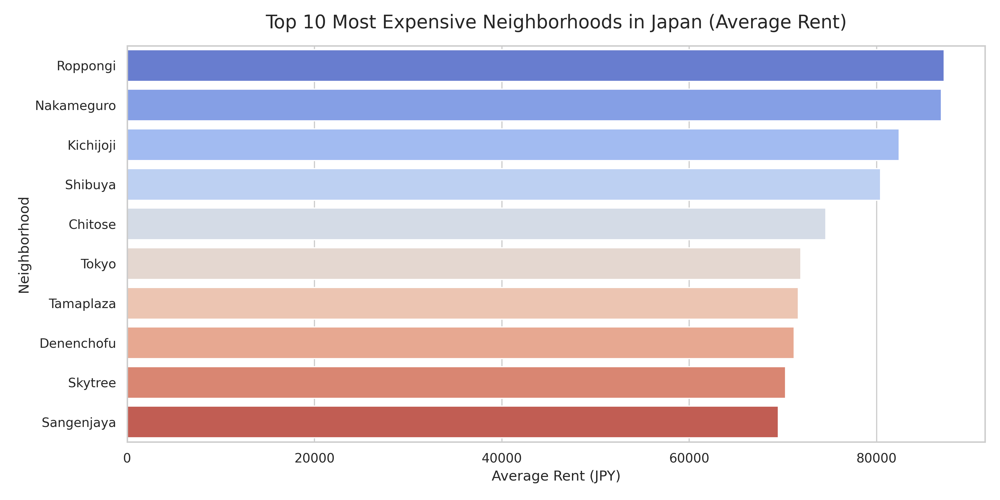

# End-to-End Medallion Architecture for rent house price

## Project Overview
An automated, scalable Data Engineering pipeline that extracts raw Japan housing data, processes it through a Medallion Architecture (Bronze, Silver, Gold), and loads it into a Google Cloud data warehouse for final analysis and visualization. 

This project was built to demonstrate containerized orchestration, secure cloud integration, and memory-safe data processing techniques.

## Architecture & Tech Stack
* **Orchestration:** Apache Airflow (Dockerized)
* **Language:** Python (google-cloud-bigquery, Matplotlib, Seaborn)
* **Data Warehouse:** Google Cloud BigQuery
* **Architecture Pattern:** Medallion (Bronze -> Silver -> Gold)
* **Environment:** GitHub Codespaces / Jupyter Notebooks

## Key Engineering Decisions
* **Memory-Safe Ingestion:** Instead of loading the entire raw dataset into local RAM using Pandas, the extraction layer utilizes native BigQuery streaming. This ensures the pipeline remains stable and scalable regardless of host hardware limitations.
* **Idempotent Data Layers:** The Bronze layer utilizes `WRITE_TRUNCATE` configurations, ensuring that daily Airflow runs are perfectly idempotent and do not create duplicate records.
* **Decoupled Visualization:** By storing the finalized "Gold" data in BigQuery, the backend architecture is completely decoupled from the presentation layer. The final business insights are rendered efficiently via cloud-executed Jupyter Notebooks.

## Presentation Layer


## How to Run Locally

1. Clone this repository:
   ```bash
   git clone [https://github.com/genieewe/housing-data-with-ggcloud](https://github.com/genieewe/housing-data-with-ggcloud)

2. Place your Google Cloud Service Account key in the /dags directory as gcp-key.json. (This is important because Airflow gotta reach your key)

3. Run this command in your Terminal to start Airflow server:
"docker compose up --build -d"

4. Navigate to http://localhost:8080, find and unpause the DAG named housing_data_pipeline, triggering the pipeline.
Note: If it throws a "This page isn't working", wait for 3-5 mins and reload

5. Open dashboard.ipynb to execute the visualization queries against the finalized BigQuery tables.
